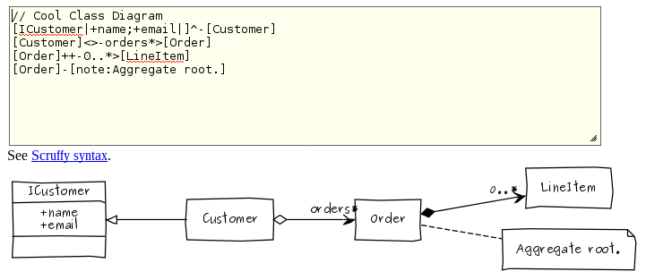
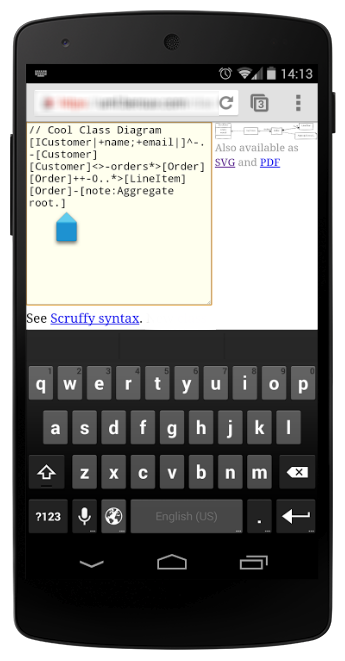

scruffy-server
==============

Micro web server front-end for [Scruffy](https://github.com/aivarsk/scruffy) UML.

So you have your own UML page like [yUML](http://yuml.me) and even more lean.

Features
--------

 * UML Class diagram
 * UML Sequence diagram
 * PNG / SVG export
 * Simple and fast interface
 * Works also without JavaScript
 * Mobile friendly

Screenshot
----------

Installation
------------

 1. Install Scruffy pre-requisites:
      * On **Ubuntu** Linux you'd do:
        `$ sudo apt-get install python-dev python-setuptools graphviz plotutils librsvg2-bin`
      * On **Arch** Linux you'd do:
        `$ pacman -S graphviz plotutils librsvg python2-pillow`
      * In *general*: You'll need [Python](http://www.python.org/), [dot](http://www.graphviz.org/), [libRSVG](https://wiki.gnome.org/Projects/LibRsvg) binaries, [pic2plot](http://www.gnu.org/software/plotutils/), and [Python Imaging Library (PIL)](http://www.pythonware.com/products/pil/) or [Python Pillow](http://pillow.readthedocs.org/).
 2. Run Scruffy-Server:

        $ git clone https://github.com/wernight/scruffy-server.git
        $ cd scruffy-server
        $ virtualenv ENV --system-site-packages && source ENV/bin/activate    # (optional)
        $ pip install -r requirements.txt
        $ python server.py

 3. Browse [http://localhost:8080/](http://localhost:8080/)

Edit the end of `server.py` to change the port or IP binding.

Deployment
----------

Check [Bottle Deployment](http://bottlepy.org/docs/dev/tutorial.html#deployment) but be aware that
there is no ACL, no spam check, and no caching. So you probably would want it only on a private network
or proxied behind a password protected URL.

Similar Tools
-------------

  * [yUML](http://yuml.me) Which is very similar commercial alternative, with Use Case, Activity, and Class diagram support (and not a so great mobile support).
  * [PlantUML](http://plantuml.sourceforge.net/) An OpenSource Java solution, also text based which supports most UML diagrams with a more classic look (and not a so great mobile support).
  * [draw.io](https://www.draw.io/) and [Lucidchart](https://www.lucidchart.com/) are also online solutions but not auto-generated from text.

*scruffy-server* is good for lean short UML diagrams even from a mobile phone or tablet.

Troubleshooting FAQ
-------------------

### Why is there no password protection or ACL?

The only real risk is that your server isn't well **sandboxed** and a user sends malicious UML code.

For users however there is **no real need for password** protection because the URL shared is the entire UML diagram source code.
This means that no one can try to guess your UML by trying random URLs (as it would only generate all possible UMLs),
and any change to an existing UML will generate a new URL. So you can generate a diagram, share it, without
ever needing a password. **Just remember: URL = UML.**

### The UML image doesn't render properly!

Check that the user running `server.py` can execute Scruffy `suml` command.

### Text looks like blocs, Pango font Warnings!

Chech [Arch Fonts - Pango Warnings](https://wiki.archlinux.org/index.php/fonts#Pango_Warnings). You may want to install `ttf-tlwg` to have *Purisa*
and a more scruffy look (a bit like *Comic Sans*).

You can also add `..., '--font-family', 'Purisa', ...` to `suml` parameters.

### How do change the UML font and style?

Change the `check_output(...)` parameters in `server.py`.
Execute `$ suml --help` to find what is allowed.
